# HW4 — SELECT и JOIN

## Основа для выполнения

Запросы написаны для PostgreSQL и схемы из HW2 после всех ALTER и UPDATE в `HW2/script.sql`.
Используются genres, movies, halls, customers, sessions, tickets. Здесь movies.country — текст, sessions.price — цена, sessions.format — формат.
В HW3 новая схема описана в отчёте, но SQL перехода в архиве отсутствует. Если база уже изменена по HW3, эти запросы нужно адаптировать перед запуском.

Виды SELECT соответствуют заголовкам презентации. На каждый вид приведено два запроса. Логические выражения и CASE вынесены в отдельные разделы. Дополнительно включены два запроса из нескольких таблиц. Всего 40 запросов.

## Выполнение и результаты

Все 40 запросов выполнены в PostgreSQL в существующей базе `cinema_db ` (в конце имени есть пробел), в транзакциях только для чтения. Данные не изменялись.

Отчёт содержит формулировки, SQL-запросы и пояснения. К каждому запросу приложен скриншот выполнения в pgAdmin.

## 1. Выборка всех данных из таблицы

Источник: слайды 8–9.

### 1.1. Вывести все данные о фильмах.

```sql
SELECT * FROM movies;
```

**Пояснение:** Звёздочка выбирает все столбцы таблицы.

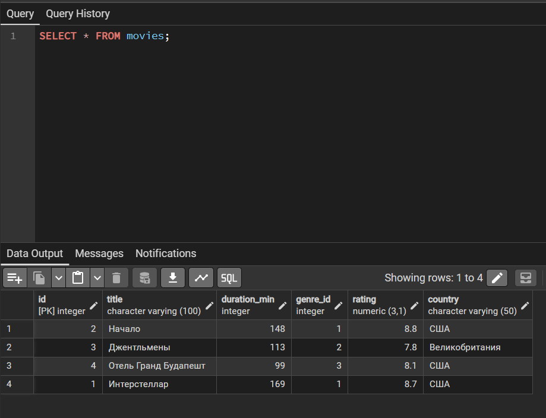

### 1.2. Вывести все данные о клиентах.

```sql
SELECT * FROM customers;
```

**Пояснение:** FROM указывает таблицу, из которой читаем данные.

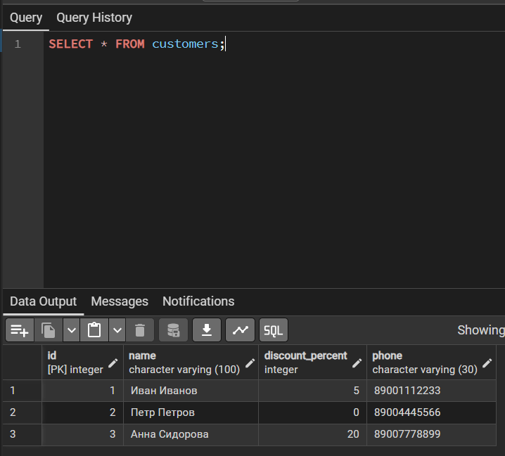

## 2. Выборка отдельных столбцов

Источник: слайды 10–11.

### 2.1. Вывести названия и рейтинги фильмов.

```sql
SELECT title, rating FROM movies;
```

**Пояснение:** Перечисляем только нужные столбцы.

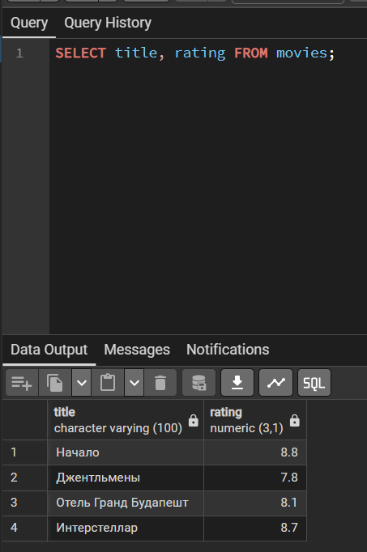

### 2.2. Вывести имена и телефоны клиентов.

```sql
SELECT name, phone FROM customers;
```

**Пояснение:** Остальные столбцы в результат не попадут.

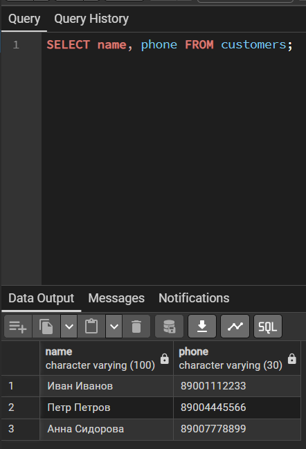

## 3. Присвоение новых имен столбцам при формировании выборки

Источник: слайды 12–13.

### 3.1. Вывести фильмы с понятными заголовками столбцов.

```sql
SELECT title AS "Фильм", duration_min AS "Длительность"
FROM movies;
```

**Пояснение:** AS меняет заголовок в результате, а не имя столбца в базе.

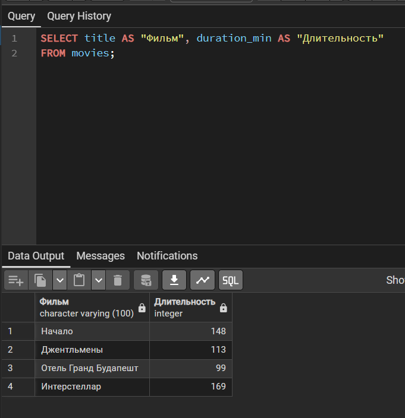

### 3.2. Вывести названия залов и количество мест.

```sql
SELECT name AS "Зал", capacity AS "Количество мест"
FROM halls;
```

**Пояснение:** Двойные кавычки позволяют использовать пробелы в заголовке.

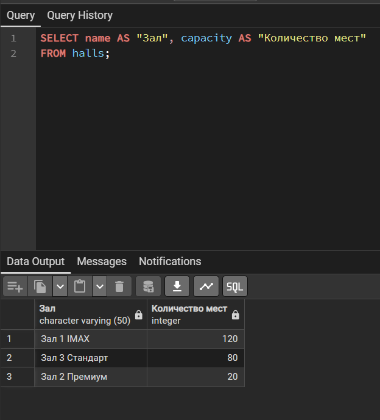

## 4. Выборка данных с созданием вычисляемого столбца

Источник: слайды 14–16.

### 4.1. Перевести длительность фильмов в часы.

```sql
SELECT title, duration_min / 60.0 AS duration_hours
FROM movies;
```

**Пояснение:** 60.0 позволяет получить дробное число часов.

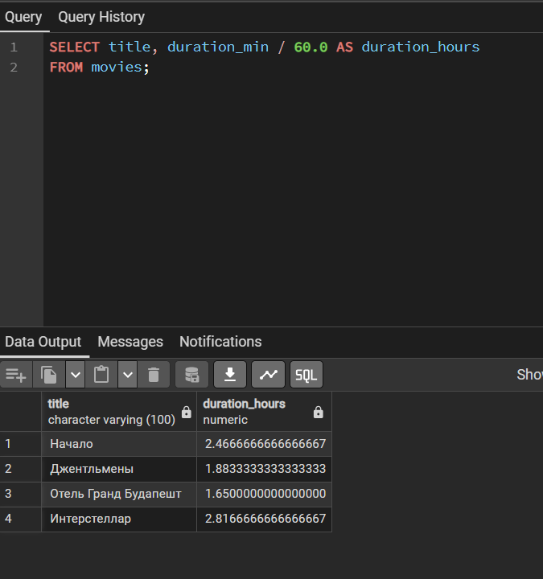

### 4.2. Рассчитать цену сеанса после скидки 10%.

```sql
SELECT id, price, price * 0.90 AS discounted_price
FROM sessions;
```

**Пояснение:** Расчёт появляется в результате и не изменяет цену в таблице.

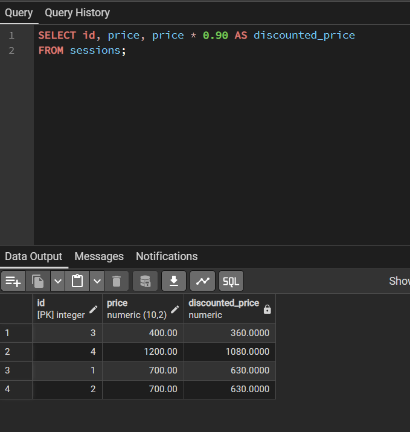

## 5. Выборка данных, вычисляемые столбцы, математические функции

Источник: слайды 17–21.

### 5.1. Округлить длительность фильмов в часах до двух знаков.

```sql
SELECT title, ROUND(duration_min / 60.0, 2) AS duration_hours
FROM movies;
```

**Пояснение:** ROUND округляет число до указанного количества знаков.

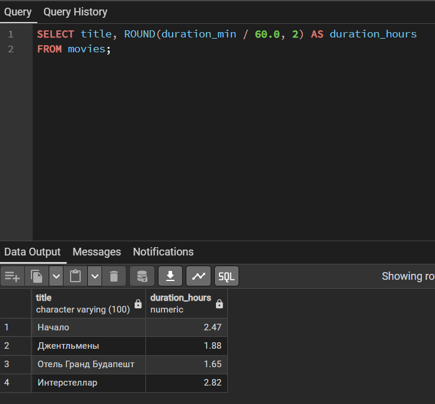

### 5.2. Найти, насколько рейтинг каждого фильма отличается от 8.

```sql
SELECT title, rating, ABS(rating - 8) AS rating_difference
FROM movies;
```

**Пояснение:** ABS возвращает модуль разности, то есть расстояние до 8.

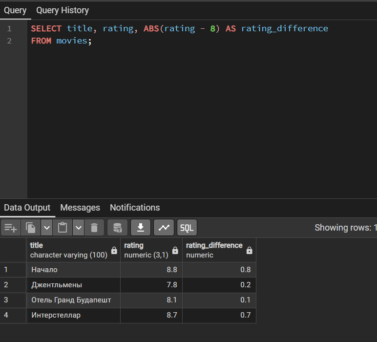

## 6. Выборка данных, вычисляемые столбцы, логические функции

Источник: слайды 22–24.

### 6.1. Для каждого фильма показать, превышает ли его рейтинг 8.

```sql
SELECT title, rating, rating > 8 AS high_rating
FROM movies;
```

**Пояснение:** Логическое выражение возвращает true или false; при NULL — NULL.

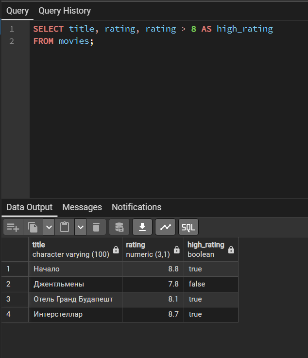

### 6.2. Для каждого клиента показать, есть ли у него скидка.

```sql
SELECT name, discount_percent, discount_percent > 0 AS has_discount
FROM customers;
```

**Пояснение:** Сравнение в SELECT создаёт столбец с логическим результатом.

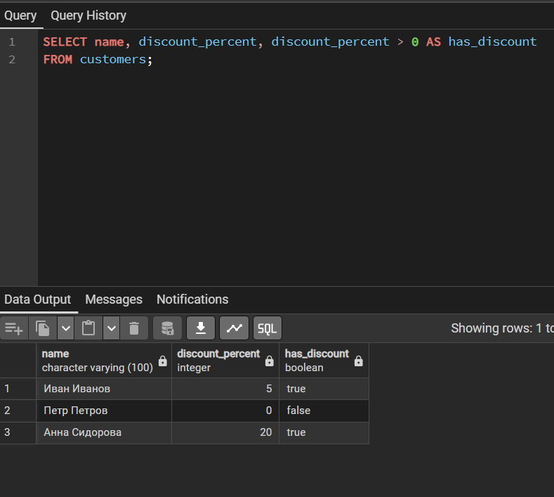

## 7. Выборка данных по условию

Источник: слайды 25–27.

### 7.1. Найти фильмы с рейтингом не ниже 8.5.

```sql
SELECT title, rating FROM movies
WHERE rating >= 8.5;
```

**Пояснение:** WHERE оставляет строки, для которых условие истинно.

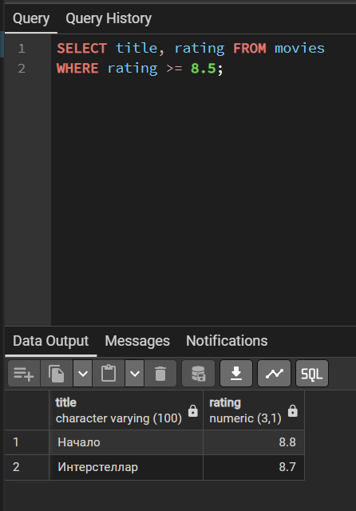

### 7.2. Найти сеансы дешевле 800 рублей.

```sql
SELECT id, start_time, price FROM sessions
WHERE price < 800;
```

**Пояснение:** Сравнение выполняется для каждой строки.

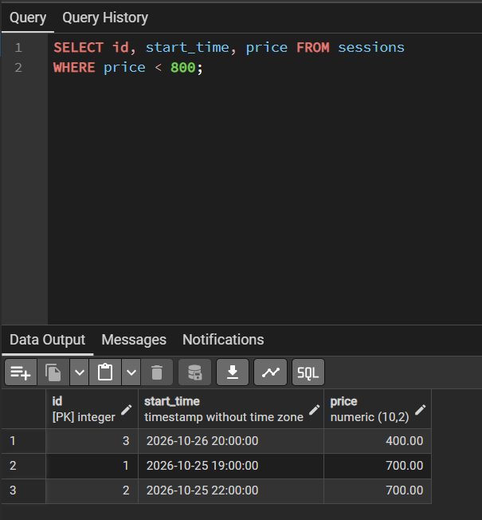

## 8. Выборка данных, логические операции

Источник: слайды 28–31.

### 8.1. Найти фильмы с рейтингом выше 8 и длительностью более 120 минут.

```sql
SELECT title, rating, duration_min FROM movies
WHERE rating > 8 AND duration_min > 120;
```

**Пояснение:** AND требует выполнения обоих условий.

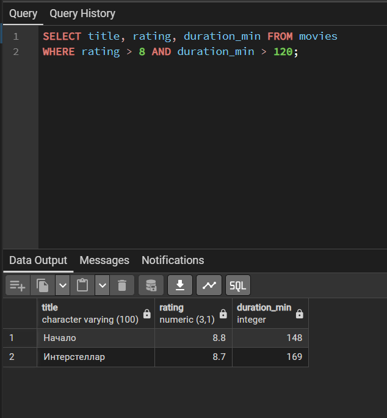

### 8.2. Найти обычные или VIP-залы вместимостью не меньше 20 мест.

```sql
SELECT name, hall_type, capacity FROM halls
WHERE (hall_type = 'Обычный' OR hall_type = 'VIP')
  AND NOT (capacity < 20);
```

**Пояснение:** Скобки объединяют альтернативы OR. NOT отрицает условие.

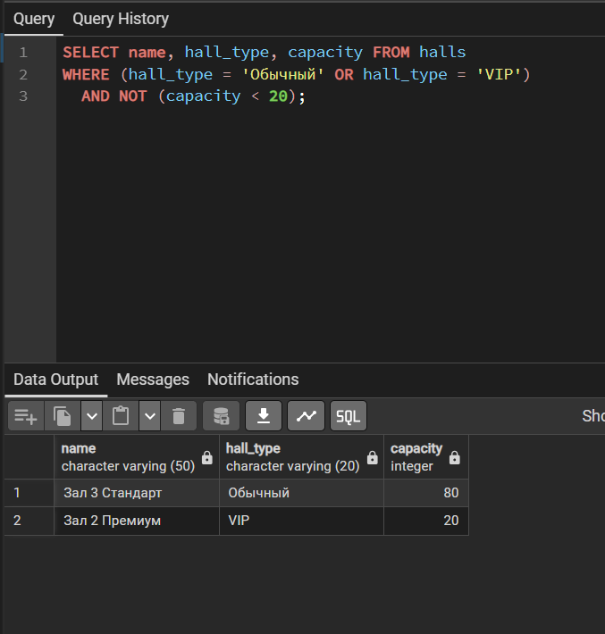

## 9. Выборка данных, операторы BETWEEN, IN

Источник: слайды 32–36.

### 9.1. Найти фильмы длительностью от 100 до 150 минут включительно.

```sql
SELECT title, duration_min FROM movies
WHERE duration_min BETWEEN 100 AND 150;
```

**Пояснение:** BETWEEN включает обе границы диапазона.

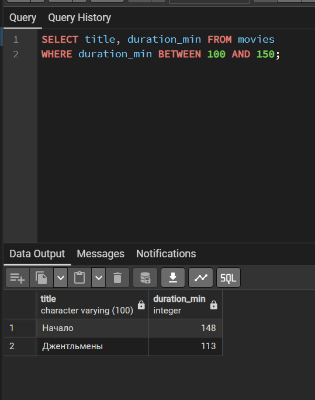

### 9.2. Найти проданные и забронированные билеты.

```sql
SELECT id, seat_number, status FROM tickets
WHERE status IN ('sold', 'booked');
```

**Пояснение:** IN проверяет наличие значения в списке.

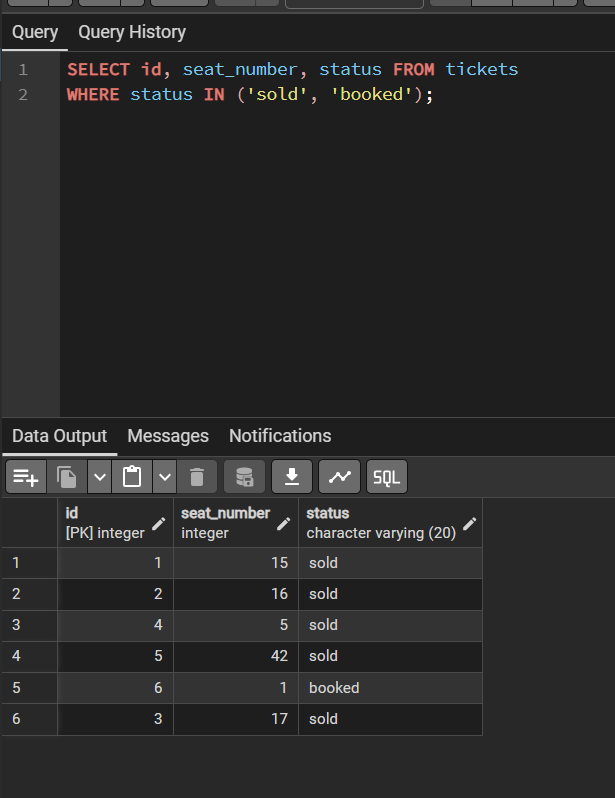

## 10. Выборка данных с сортировкой

Источник: слайды 37–39.

### 10.1. Вывести фильмы по убыванию рейтинга.

```sql
SELECT title, rating FROM movies
ORDER BY rating DESC, title ASC;
```

**Пояснение:** DESC задаёт убывание; при равных рейтингах сортируем по названию.

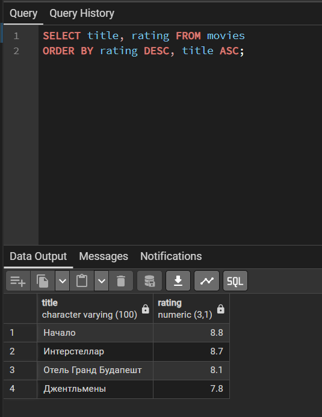

### 10.2. Вывести билеты по сеансу, затем по номеру места.

```sql
SELECT id, session_id, seat_number FROM tickets
ORDER BY session_id ASC, seat_number ASC;
```

**Пояснение:** Второй столбец задаёт порядок внутри одинаковых значений первого.

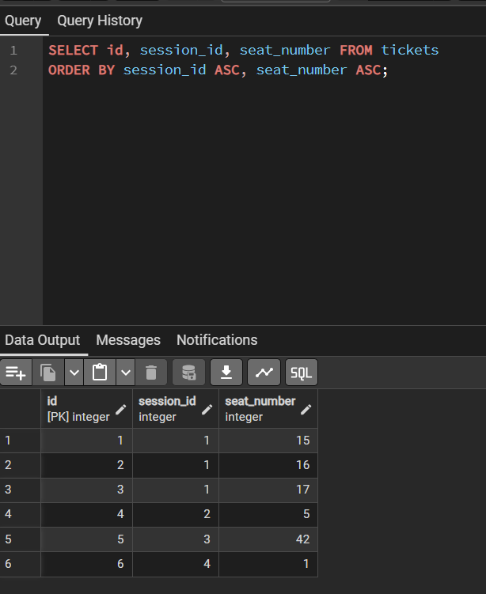

## 11. Выборка данных, оператор LIKE

Источник: слайды 40–45.

### 11.1. Найти фильмы, название которых начинается с «Интер».

```sql
SELECT title FROM movies
WHERE title LIKE 'Интер%';
```

**Пояснение:** Процент означает любое количество символов, включая ноль.

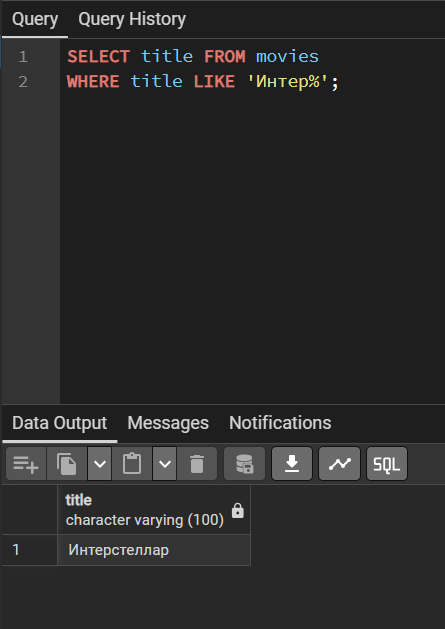

### 11.2. Найти клиентов, телефон которых начинается с 8900 и содержит 11 символов.

```sql
SELECT name, phone FROM customers
WHERE phone LIKE '8900_______';
```

**Пояснение:** Каждое подчёркивание означает ровно один символ; здесь их семь.

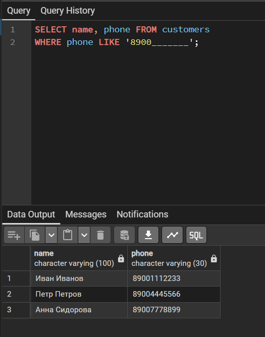

## 12. Выбор уникальных элементов столбца

Источник: слайды 46.

### 12.1. Вывести страны производства фильмов без повторов.

```sql
SELECT DISTINCT country FROM movies
ORDER BY country;
```

**Пояснение:** DISTINCT убирает повторяющиеся строки результата.

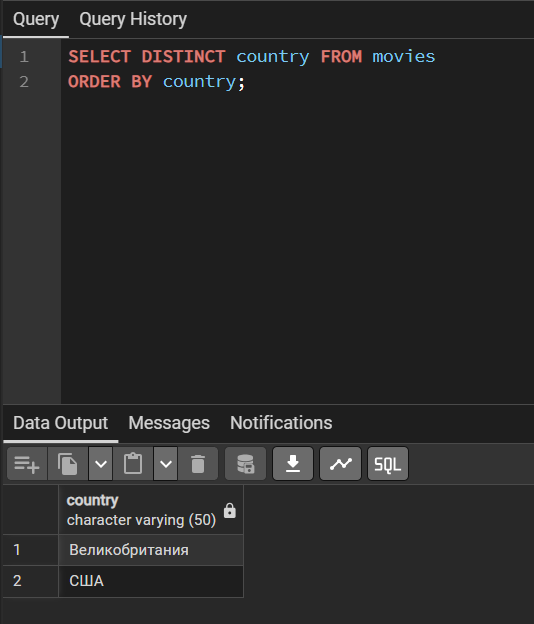

### 12.2. Вывести используемые статусы билетов без повторов.

```sql
SELECT DISTINCT status FROM tickets
ORDER BY status;
```

**Пояснение:** Каждый встречающийся статус выводится один раз.

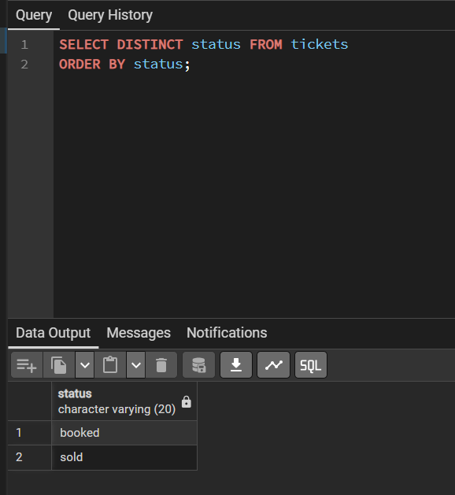

## 13. Выбор ограниченного количества возвращаемых строк

Источник: слайды 47.

### 13.1. Вывести два фильма с самым высоким рейтингом.

```sql
SELECT title, rating FROM movies
ORDER BY rating DESC, id
LIMIT 2;
```

**Пояснение:** LIMIT ограничивает число строк. Сортировка определяет, какие строки попадут в результат.

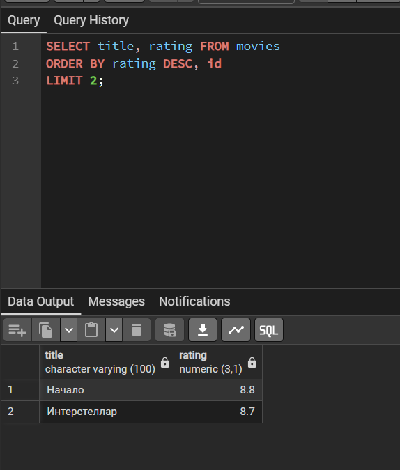

### 13.2. Вывести следующие два фильма после первых двух по рейтингу.

```sql
SELECT title, rating FROM movies
ORDER BY rating DESC, id
LIMIT 2 OFFSET 2;
```

**Пояснение:** OFFSET пропускает первые две строки; id разрешает совпадения рейтингов.

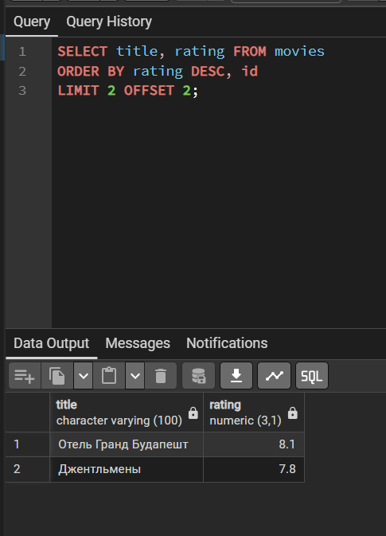

## 14. CASE

Источник: слайды дополнительное требование ДЗ.

### 14.1. Разделить фильмы по рейтингу на три категории.

```sql
SELECT title, rating,
       CASE
           WHEN rating >= 8.5 THEN 'Высокий'
           WHEN rating >= 8 THEN 'Хороший'
           WHEN rating IS NULL THEN 'Не указан'
           ELSE 'Ниже 8'
       END AS rating_category
FROM movies;
```

**Пояснение:** CASE проверяет условия сверху вниз и выбирает первый подходящий ответ.

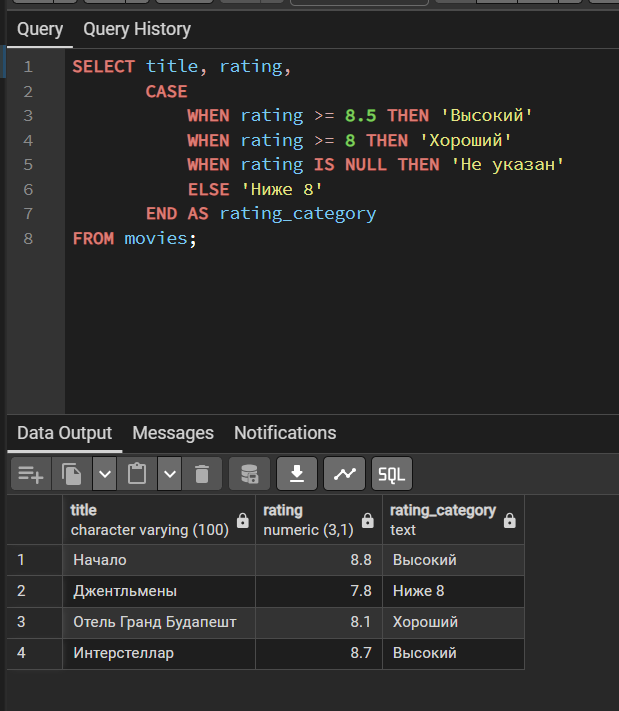

### 14.2. Вывести статусы билетов по-русски.

```sql
SELECT id, seat_number,
       CASE status
           WHEN 'sold' THEN 'Продан'
           WHEN 'booked' THEN 'Забронирован'
           WHEN 'returned' THEN 'Возвращён'
           ELSE 'Неизвестен'
       END AS status_name
FROM tickets;
```

**Пояснение:** Этот вариант CASE сравнивает одно значение с перечисленными вариантами.

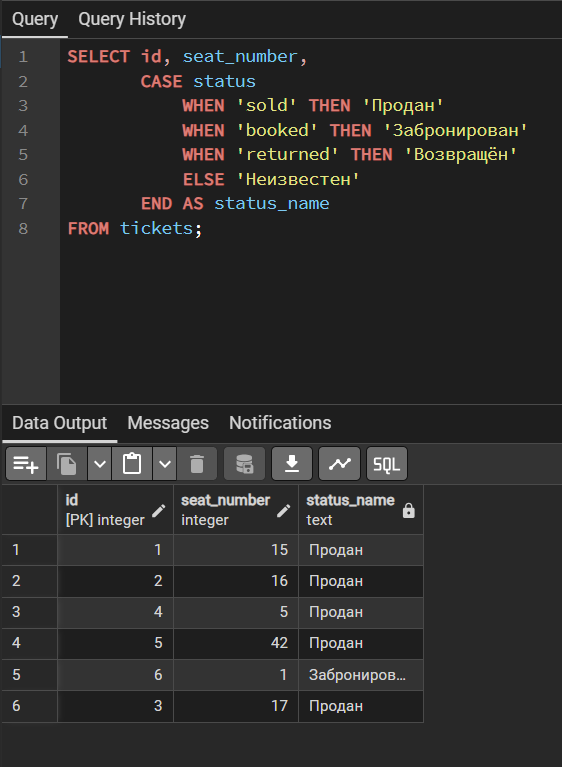

## 15. Соединение INNER JOIN

Источник: слайды 50–53.

### 15.1. Вывести названия фильмов и их жанры.

```sql
SELECT m.title, g.name AS genre
FROM movies m
INNER JOIN genres g ON m.genre_id = g.id
ORDER BY m.id;
```

**Пояснение:** Остаются только пары строк, удовлетворяющие условию ON.

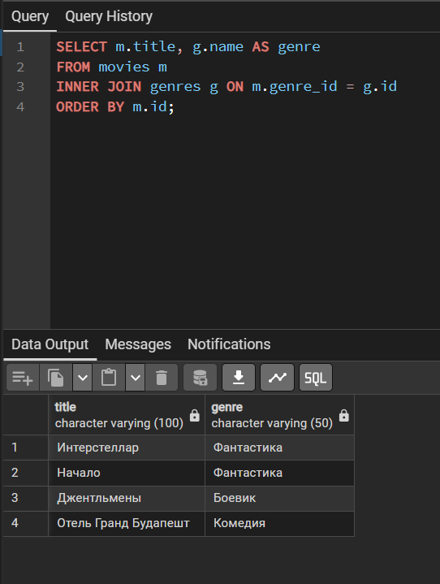

### 15.2. Вывести билеты с именами покупателей.

```sql
SELECT t.id AS ticket_id, c.name, t.seat_number
FROM tickets t
INNER JOIN customers c ON t.customer_id = c.id
ORDER BY t.id;
```

**Пояснение:** Связываем customer_id билета с id клиента.

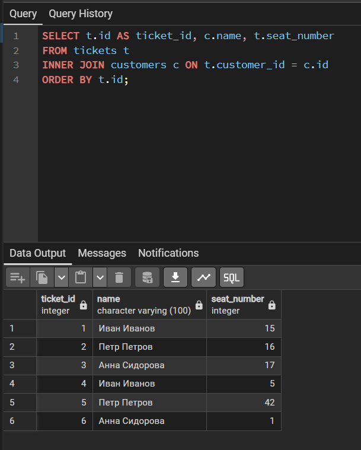

## 16. Соединение LEFT JOIN

Источник: слайды 54–56.

### 16.1. Вывести все жанры и соответствующие фильмы, включая жанры без фильмов.

```sql
SELECT g.name AS genre, m.title
FROM genres g
LEFT JOIN movies m ON g.id = m.genre_id
ORDER BY g.id, m.id;
```

**Пояснение:** Сохраняются все жанры слева. У жанра «Драма» название фильма будет NULL.

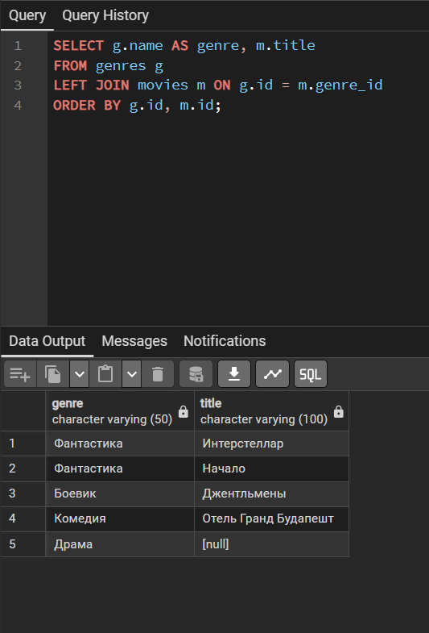

### 16.2. Вывести все фильмы и их сеансы, включая фильмы без сеансов.

```sql
SELECT m.title, s.id AS session_id, s.start_time
FROM movies m
LEFT JOIN sessions s ON m.id = s.movie_id
ORDER BY m.id, s.id;
```

**Пояснение:** Сохраняются все фильмы. В данных HW2 у каждого фильма есть сеанс, поэтому NULL здесь не появится.

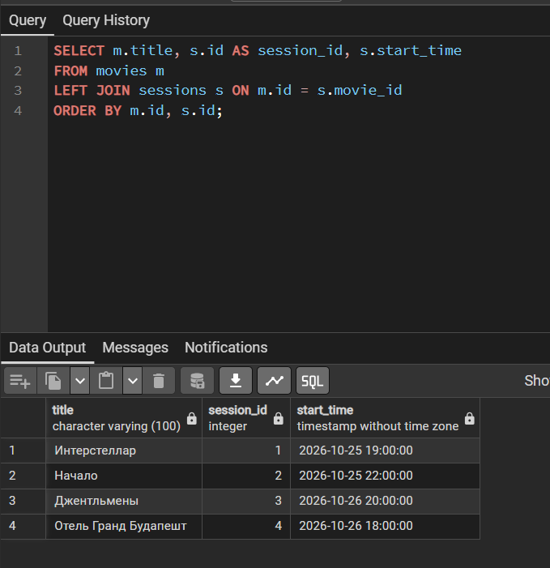

## 17. Соединение RIGHT JOIN

Источник: слайды 54–56.

### 17.1. Вывести фильмы и все жанры, включая жанры без фильмов.

```sql
SELECT m.title, g.name AS genre
FROM movies m
RIGHT JOIN genres g ON m.genre_id = g.id
ORDER BY g.id, m.id;
```

**Пояснение:** Сохраняются все строки правой таблицы genres. Для «Драмы» фильм будет NULL.

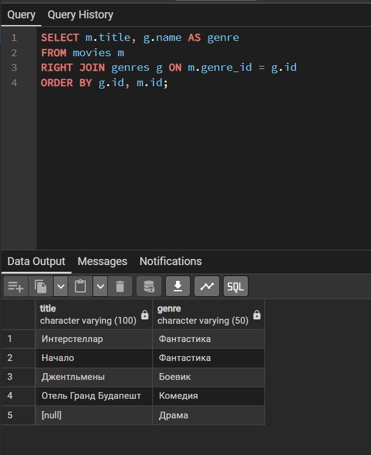

### 17.2. Вывести сеансы и все залы, включая залы без сеансов.

```sql
SELECT s.id AS session_id, h.name AS hall, s.start_time
FROM sessions s
RIGHT JOIN halls h ON s.hall_id = h.id
ORDER BY h.id, s.id;
```

**Пояснение:** Сохраняются все залы справа. В данных HW2 все залы используются.

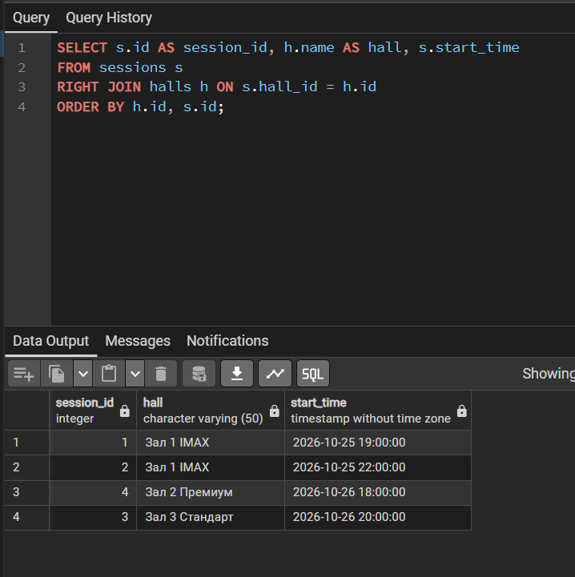

## 18. Соединение CROSS JOIN

Источник: слайды 57–59.

### 18.1. Получить все возможные сочетания фильмов и залов для планирования.

```sql
SELECT m.title, h.name AS hall
FROM movies m
CROSS JOIN halls h
ORDER BY m.id, h.id;
```

**Пояснение:** Каждый из четырёх фильмов сочетается с каждым из трёх залов: 12 строк. Это варианты, а не реальные сеансы.

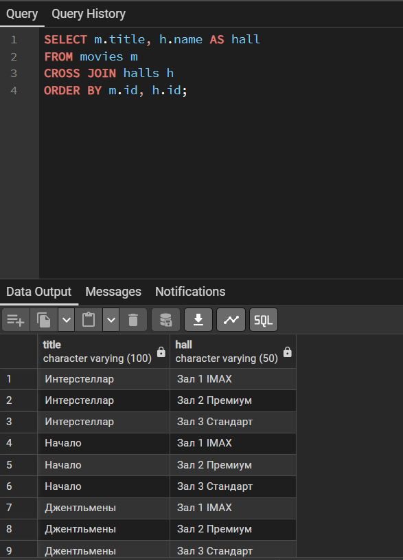

На скриншоте показаны первые 9 из 12 строк результата.

### 18.2. Получить все сочетания клиентов и жанров для опроса о предпочтениях.

```sql
SELECT c.name AS customer, g.name AS genre
FROM customers c
CROSS JOIN genres g
ORDER BY c.id, g.id;
```

**Пояснение:** Три клиента и четыре жанра дают 12 сочетаний. У CROSS JOIN нет условия ON.

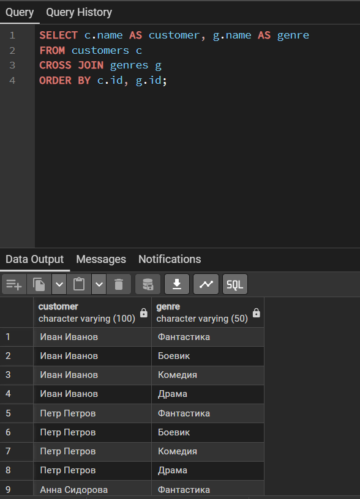

На скриншоте показаны первые 9 из 12 строк результата.

## 19. Соединение FULL OUTER JOIN

Источник: слайды все виды JOIN из условия ДЗ.

### 19.1. Вывести все фильмы и жанры, сохранив строки без совпадений с обеих сторон.

```sql
SELECT m.title, g.name AS genre
FROM movies m
FULL OUTER JOIN genres g ON m.genre_id = g.id
ORDER BY g.id, m.id;
```

**Пояснение:** Сохраняются обе таблицы. В HW2 появится «Драма» без фильма; фильмы без жанра тоже сохранились бы.

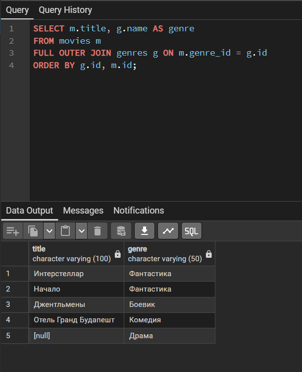

### 19.2. Сопоставить проданные и забронированные билеты по клиенту и показать обе группы целиком.

```sql
SELECT sold.customer_id AS sold_customer_id,
       sold.id AS sold_ticket_id,
       booked.customer_id AS booked_customer_id,
       booked.id AS booked_ticket_id
FROM (SELECT id, customer_id FROM tickets WHERE status = 'sold') sold
FULL OUTER JOIN
     (SELECT id, customer_id FROM tickets WHERE status = 'booked') booked
ON sold.customer_id = booked.customer_id
ORDER BY COALESCE(sold.customer_id, booked.customer_id), sold.id, booked.id;
```

**Пояснение:** Получаем две выборки из tickets и соединяем их. После UPDATE в HW2 у Ивана и Петра нет броней: booked_ticket_id будет NULL. У Анны есть и продажа, и бронь. При нескольких билетах с обеих сторон получатся все пары одного клиента.

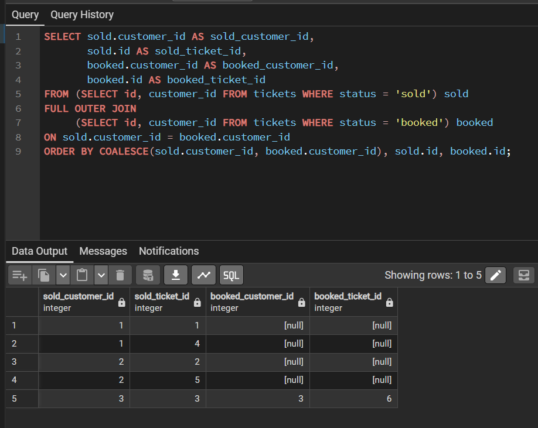

## 20. Запросы на выборку из нескольких таблиц

Источник: слайды 60–61.

### 20.1. Вывести билеты с именем клиента, фильмом и временем сеанса.

```sql
SELECT t.id AS ticket_id, c.name AS customer, m.title, s.start_time
FROM tickets t
INNER JOIN customers c ON t.customer_id = c.id
INNER JOIN sessions s ON t.session_id = s.id
INNER JOIN movies m ON s.movie_id = m.id
ORDER BY t.id;
```

**Пояснение:** Идём по связям: билет — клиент, билет — сеанс, сеанс — фильм.

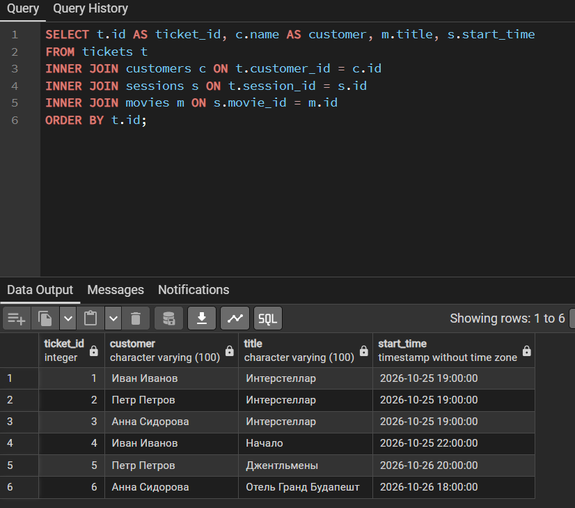

### 20.2. Вывести расписание с фильмом, жанром и залом.

```sql
SELECT s.id AS session_id, m.title, g.name AS genre,
       h.name AS hall, s.start_time
FROM sessions s
INNER JOIN movies m ON s.movie_id = m.id
INNER JOIN genres g ON m.genre_id = g.id
INNER JOIN halls h ON s.hall_id = h.id
ORDER BY s.start_time, s.id;
```

**Пояснение:** Для каждой пары таблиц указываем отдельный JOIN и условие ON.

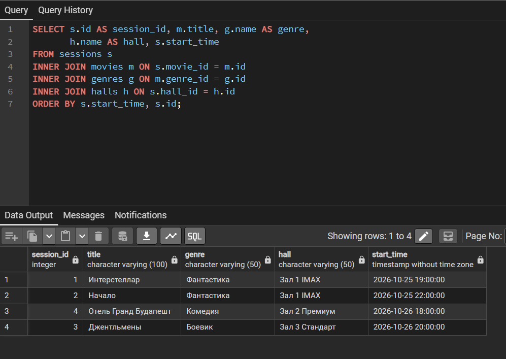


